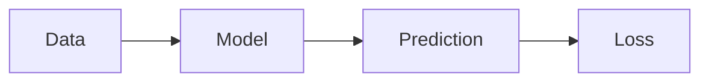

# Technical posts

Use `technical: true` and `essay: false` in both translations. The public EN and ES
articles share the same renderer. Write these examples in the editor's Markdown
mode or directly in the repository. The editor is a source editor; check the
rendered article in the built preview before publishing.

## Math

Write inline math as `$x^2 + y^2 = z^2$`, with a space before the opening delimiter.
For display equations, put the double-dollar delimiters on separate lines:

```tex
$$
\mathcal{L}(\theta) = \frac{1}{N}\sum_{i=1}^{N}(y_i-f_\theta(x_i))^2
$$
```

KaTeX renders HTML and accessible MathML on the server. This supports
[KaTeX's math syntax](https://katex.org/docs/supported.html), not complete LaTeX
documents or arbitrary packages. Escape literal dollar signs as `\$`; inline and
fenced code stay literal. Invalid expressions remain visible for correction.

## Code

Name the language after the opening fence:

````markdown
```python
def square(x):
    return x ** 2
```
````

Highlight.js's common language set includes Python, JavaScript, TypeScript, SQL,
Bash, JSON, YAML, CSS, HTML/XML, Go, Rust, Java, C/C++, and Markdown. Unknown or
unnamed languages remain readable escaped text. Code scrolls horizontally on
small screens and uses colours matched to the light and dark site themes.

## Mermaid diagrams

````markdown

````

Mermaid loads only when a diagram is present. The diagram's source remains
available below it, and remains readable if JavaScript is disabled or the diagram
cannot render. Add `accTitle` and `accDescr` to describe the diagram. Use Mermaid
for flowcharts, sequences, and similar diagrams; author isometric artwork as SVG
or as a standalone interactive document.

## Exported isometric diagrams and animations

```markdown


```

SVG uses the existing image rendering and zoom. `.mp4` and `.webm` references in
image syntax render a responsive video with native playback controls, without
autoplay. Include a nearby explanation or transcript if the animation conveys
information that is not in the prose. Animated SVG/GIF files run according to
their own animation rules; prefer controlled video for motion that readers can
pause.

## Interactive isometric visuals

````markdown
```interactive
{"src":"/visuals/model-layers.html","title":"Explore the model layers","height":480}
```
````

Use a self-contained HTML document or an embeddable HTTPS URL. A descriptive title
is required; height defaults to 480 pixels and accepts integers from 240 to 960.
The frame fills the article width. The sandbox permits JavaScript, but does not
grant access to the parent page, cookies, local storage, popups, or navigation.
Use inline scripts or bundles that work from an opaque origin. External hosts
must permit framing. Build keyboard controls and a `prefers-reduced-motion`
fallback into each interactive document; the parent page cannot control its
internal animation. Pair it with a static image and explanatory prose.

## Files and publishing

- SVG/images can use the existing image uploader and `/uploads/*` URLs.
- Put videos and self-contained HTML/CSS/JS assets under `static/visuals/` to serve
  them at `/visuals/…`, or host them at an HTTPS URL. The build copies that folder.
  Adding or changing these files requires a Worker build and deployment. Use
  versioned filenames when replacing an asset.
- The image uploader remains image-only. It does not upload videos or HTML.
- Markdown saves continue through GitHub and the D1 projection. New saves use this
  renderer. Older stored HTML needs a content resave or an explicitly authorized
  re-projection to acquire the new formatting.
- Validate EN and ES articles, light/dark themes, a narrow viewport, diagram
  source disclosure, video playback, and interactive controls before publication.
- Deploy the runtime changes before publishing posts that rely on these formats.

Renderer references: [KaTeX options](https://katex.org/docs/options.html),
[Highlight.js API](https://highlightjs.readthedocs.io/en/latest/api.html), and
[Mermaid usage](https://mermaid.js.org/config/usage.html).
